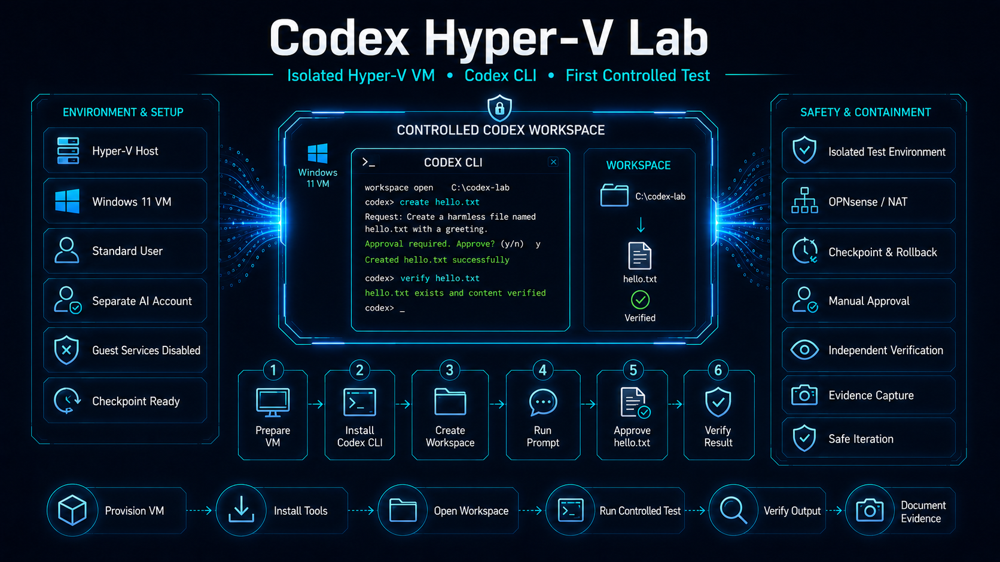

# Codex Hyper-V Lab



Ez a repository egy elkülönített Hyper-V virtuális gépben futó Codex CLI kontrollált kipróbálását dokumentálja.

A projekt célja nem egy éles fejlesztési környezet kialakítása, hanem annak gyakorlati vizsgálata, hogyan használható egy lokálisan futó coding agent biztonságtudatosan, manuális ellenőrzéssel és visszaállítható laborállapotokkal.

## Fő elvek

- külön Windows 11 virtuális gép;
- internetelérés OPNsense EDGE NAT-rétegen keresztül;
- közvetlen host–vendég fájlmegosztás nélkül;
- munkahelyi és személyes adatok nélkül;
- külön standard jogosultságú helyi felhasználóval;
- manuális Hyper-V-ellenőrzőpontokkal;
- mesterséges tesztadatokkal;
- a Codex által javasolt módosítások manuális jóváhagyásával;
- Codextől független visszaellenőrzéssel.

## Jelenlegi állapot

Az első kontrollált teszt lezárult. A Codex egy elkülönített munkamappában létrehozott egyetlen `hello.txt` fájlt, a módosítások előtt jóváhagyást kért, majd a tartalom Codextől független PowerShell-ellenőrzése is sikeres volt.

A teszt a nem rendszergazdai Windows-sandbox használatával futott.

## Dokumentáció

A részletes dokumentáció magyar nyelvű, de a fájl- és mappanevek angolul szerepelnek.

| Dokumentum                                                                 | Tartalom                                                                             |
| -------------------------------------------------------------------------- | ------------------------------------------------------------------------------------ |
| [`docs/01_environment_setup.md`](docs/01_environment_setup.md)             | Hyper-V környezet, biztonsági beállítások, standard felhasználó, Codex CLI telepítés |
| [`docs/02_command_log.md`](docs/02_command_log.md)                         | A ténylegesen használt PowerShell- és Codex-parancsok időrendi naplója               |
| [`docs/03_first_controlled_test.md`](docs/03_first_controlled_test.md)     | Az első kontrollált fájllétrehozási teszt dokumentációja                             |
| [`docs/04_findings_and_next_steps.md`](docs/04_findings_and_next_steps.md) | Tapasztalatok, korlátok és következő lépések                                         |

Angol rövid összefoglaló:

- [`README-en.md`](README-en.md)

## Mappaszerkezet

```text
codex-hyperv-lab/
│
├── README.md
├── README-en.md
│
├── docs/
│   ├── 01_environment_setup.md
│   ├── 02_command_log.md
│   ├── 03_first_controlled_test.md
│   └── 04_findings_and_next_steps.md
│
├── images/
│   ├── 00_project_hero/
│   ├── 01_environment_setup/
│   └── 03_first_controlled_test/
│
└── samples/
    └── 03_first_controlled_test/
        └── hello.txt
```

## Mintaállomány

Az első teszt során létrehozott, ártalmatlan mintafájl:

- [`samples/03_first_controlled_test/hello.txt`](samples/03_first_controlled_test/hello.txt)

## Megjegyzés

A repository tanulási és dokumentációs célú. Nem tartalmaz jelszót, API-kulcsot, GitHub-tokent, munkamenet-azonosítót, munkahelyi fájlt vagy valódi adatot.

## Kapcsolódó projekt

Ez a labor egy nagyobb portfóliófolyamat egyik előkészítő eleme.

A `codex-hyperv-lab` azt dokumentálja, hogyan alakítottam ki egy izolált, kontrollált Codex CLI tesztkörnyezetet Hyper-V virtuális gépben. A több adatbázis-kezelővel végzett alapozó munka külön repositoryban található:

- [multi-rdbms-comparison-lab](https://github.com/egyprogramozo/multi-rdbms-comparison-lab)

Ezekre épül a következő gyakorlati projekt:

- [multi-rdbms-data-extraction-lab](https://github.com/egyprogramozo/multi-rdbms-data-extraction-lab)

A `multi-rdbms-data-extraction-lab` célja több RDBMS-forrásból és egy manuális CSV-forrásból történő kontrollált adatkinyerés dokumentálása. Ebben a Codex nem önálló döntéshozóként, hanem ellenőrzött, izolált fejlesztési segédeszközként jelenik meg.
