# Codex Hyper-V Lab – Környezet kialakítása

## A projekt célja

Ez a projekt a Codex CLI kontrollált kipróbálását dokumentálja egy külön erre a célra létrehozott Hyper-V virtuális gépben.

Az elsődleges cél az AI-val támogatott fejlesztési munkafolyamatok vizsgálata egy eldobható és visszaállítható tesztkörnyezetben úgy, hogy közben ne kerüljenek veszélybe:

- a host gép fájljai;
- személyes adatok;
- munkahelyi adatok;
- GitHub-hozzáférési adatok;
- valódi fejlesztési vagy éles rendszerek.

A kezdeti kísérletek kizárólag mesterséges tesztadatokkal és manuálisan ellenőrzött fájlokkal történnek.

## Virtuális gép

A teszteléshez külön Windows 11 virtuális gép készült Hyper-V-ben.

### Erőforrások

```text
Virtuális gép neve: XGYAK-Codex-AI
Operációs rendszer: Windows 11
Memória: 16 GB
Virtuális processzorok száma: 12
Virtuális merevlemez mérete: 80 GB
Virtuális TPM: engedélyezve
Biztonságos rendszerindítás: engedélyezve
```

A kiosztott erőforrások elegendők a helyi teszteléshez, miközben a virtuális gép továbbra is könnyen visszaállítható és szükség esetén eldobható marad.

## Hálózati kialakítás

A virtuális gép az internetet a korábban kialakított OPNsense EDGE tűzfalon és NAT-rétegen keresztül éri el.

```text
Hyper-V virtuális switch: vSW-GYAK1-LAB-PVT
Internetelérés: OPNsense EDGE-en keresztül
Közvetlen kapcsolat a fizikai otthoni hálózattal: nincs
Közvetlen host–vendég fájlmegosztás: nincs
HG-LAB belső szolgáltatások használata: az első tesztek során nem szükséges
```

A Codex CLI telepítéséhez és hitelesítéséhez internetkapcsolatra van szükség.

A virtuális gép nem kapcsolódik munkahelyi rendszerekhez, éles szolgáltatásokhoz vagy valódi adatkészletekhez.

A VM a meglévő HG-LAB privát virtuális switchéhez csatlakozik. Emiatt az ugyanarra a hálózati szegmensre kapcsolt és egyidejűleg futó virtuális gépek hálózati elérhetősége technikailag lehetséges. A kezdeti tesztek során csak a szükséges virtuális gépek futnak.

## Hyper-V biztonsági beállítások

A virtuális gépen engedélyezve van a biztonságos rendszerindítás és a virtuális platformmegbízhatósági modul.

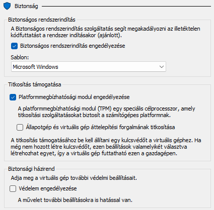

A Hyper-V vendéggép-szolgáltatása ki van kapcsolva, mert ebben a laborban nincs szükség közvetlen host–vendég fájlmásolásra.

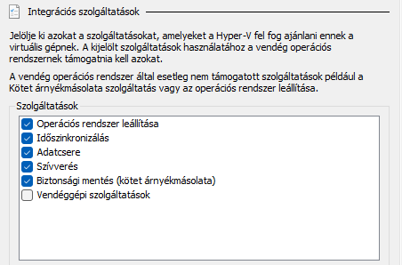

A virtuális gép normál működéséhez szükséges többi integrációs szolgáltatás bekapcsolva maradt, például:

- az operációs rendszer szabályos leállítása;
- időszinkronizálás;
- adatcsere;
- vendég operációs rendszer állapotfigyelése (Heartbeat);
- biztonsági mentési támogatás.

## Tiszta Windows 11 alapállapot

A Windows 11 telepítése után az elérhető rendszerfrissítések telepítésre kerültek.

A további módosítások előtt elkészült egy tiszta Hyper-V-ellenőrzőpont:

```text
00-win11-clean-updated
```

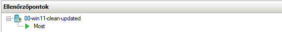

Ez az ellenőrzőpont újra felhasználható kiindulási állapotot biztosít a későbbi kísérletekhez.

Az ellenőrzőpont visszaállítása után az alábbi paranccsal ellenőrizhető, hogy a Codex CLI még nincs telepítve:

```powershell
where.exe codex
```

Az elvárt eredmény:

```text
INFO: Could not find files for the given pattern(s).
```

## Elkülönített standard felhasználói fiók

A Codex CLI telepítése előtt létrehozásra került egy külön helyi Windows-felhasználó:

```text
CodexLabUser
```

Ez a fiók standard jogosultságú helyi felhasználó, és nem tagja a helyi rendszergazdák csoportjának.

Ez további védelmi réteget jelent az egyébként is eldobható Windows 11 virtuális gépen belül. A Codex CLI telepítése és az első kísérletek kizárólag ebből a fiókból történnek.

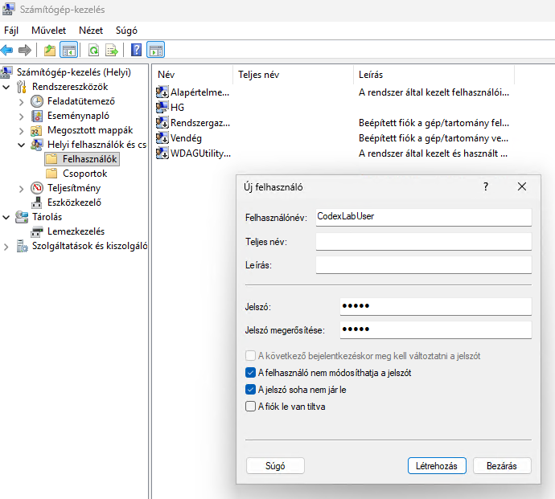

A laborfióknál kényelmi okból kikapcsolásra került a jelszó lejárata, valamint korlátozva lett a jelszó módosítása. Ezek kizárólag erre az eldobható tesztkörnyezetre vonatkozó beállítások, nem általános javaslatok éles vagy vállalati környezethez.

## Hyper-V bővített munkamenet

A standard felhasználói fiók hozzá lett adva a távoli asztali felhasználók listájához, hogy használható legyen a Hyper-V bővített munkamenete.

A bővített munkamenet elsősorban kényelmi célokat szolgál: lehetővé teszi, hogy a host gép és a virtuális gép között nem érzékeny szöveges parancsokat másoljunk át a vágólapon keresztül.

A virtuális gép számára nem kerülnek megosztásra:

- hostmeghajtók;
- USB-eszközök;
- személyes fájlok;
- munkahelyi adatok;
- jelszavak;
- API-kulcsok;
- GitHub-tokenek.

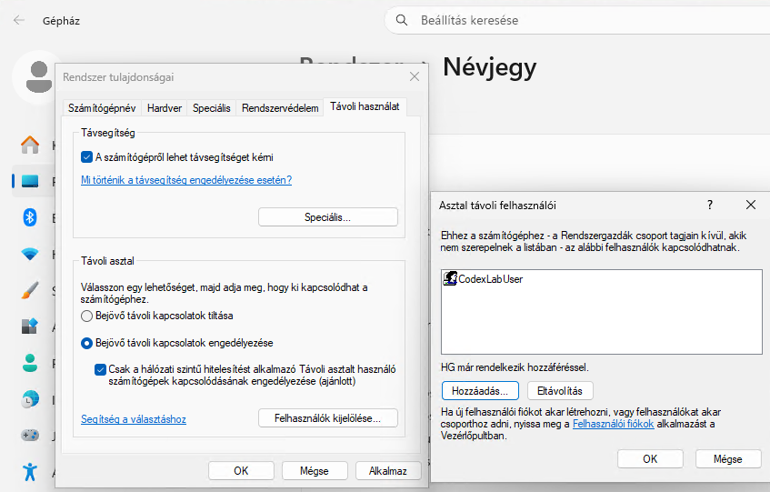

## A standard felhasználó ellenőrzése

A külön felhasználói fiókkal történt bejelentkezés után az aktuális Windows-identitás az alábbi paranccsal lett ellenőrizve:

```powershell
whoami
```

A kapott eredmény:

```text
gyak-codex-ai\codexlabuser
```

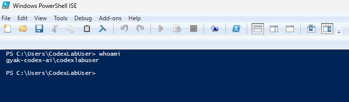

A felhasználói elkülönítés elkészülte után új Hyper-V-ellenőrzőpont készült:

```text
01-standard-user-ready
```

## Codex CLI telepítése

A Codex CLI telepítése kizárólag a `CodexLabUser` standard jogosultságú profiljából történt, normál, nem emelt jogosultságú PowerShell-munkamenetben.

```powershell
powershell -ExecutionPolicy ByPass -c "irm https://chatgpt.com/codex/install.ps1 | iex"
```

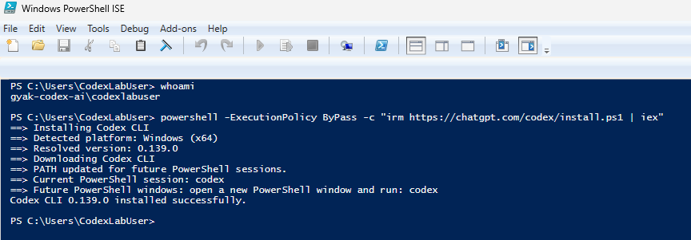

A telepítés után egy új PowerShell-ablakban ellenőrzésre került az aktuális felhasználó és a telepített Codex CLI verziója:

```powershell
whoami
codex --version
```

A kapott eredmény:

```text
gyak-codex-ai\codexlabuser
codex-cli 0.139.0
```

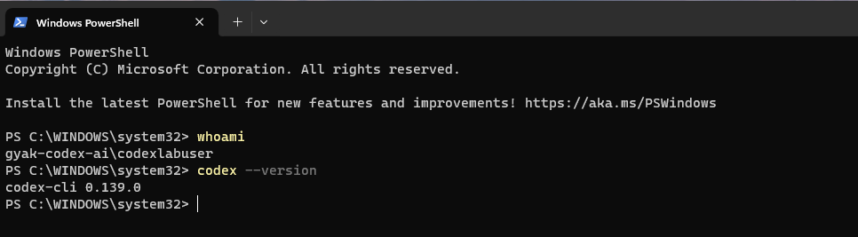

Az első Codex-indítás és hitelesítés előtt új Hyper-V-ellenőrzőpont készült:

```text
02-standard-user-codex-cli-installed
```

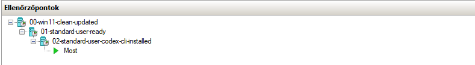

## Elkülönített munkamappa

A Codex CLI első indítása előtt külön, kezdetben üres munkamappa készült a standard felhasználó saját profilján belül:

```powershell
New-Item -ItemType Directory -Path "$HOME\CodexLab\01-first-test" -Force
Set-Location "$HOME\CodexLab\01-first-test"
Get-Location
Get-ChildItem -Force
```

Az ellenőrzött munkakönyvtár:

```text
C:\Users\CodexLabUser\CodexLab\01-first-test
```

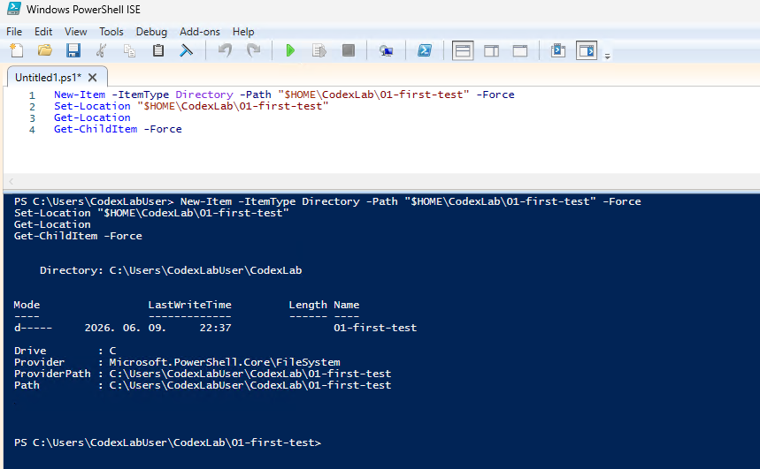

## ChatGPT-fiókos hitelesítés

A Codex CLI hitelesítése a külön létrehozott standard felhasználóból történt:

```powershell
whoami
codex login
```

A sikeres bejelentkezés után az aktív hitelesítési mód ellenőrzése:

```powershell
codex login status
```

A kapott eredmény:

```text
Logged in using ChatGPT
```

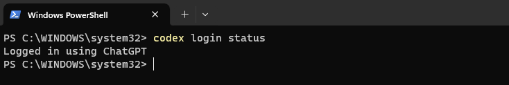

A hitelesítést követően nem készült új Hyper-V-ellenőrzőpont, mert az már helyben tárolt hozzáférési adatokat is tartalmazhatna.

## Az első interaktív indítás

A Codex az elkülönített munkamappából indult el:

```powershell
Set-Location "$HOME\CodexLab\01-first-test"
Get-Location
codex
```

Az első indításkor a Codex megbízhatósági megerősítést kért az aktuális könyvtárhoz.

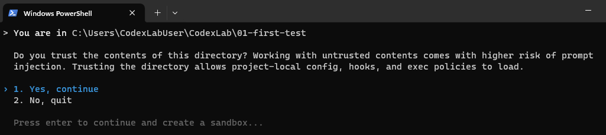

Az ajánlott, emelt jogosultságot igénylő natív Windows-sandbox automatikus kialakítása első alkalommal nem sikerült.

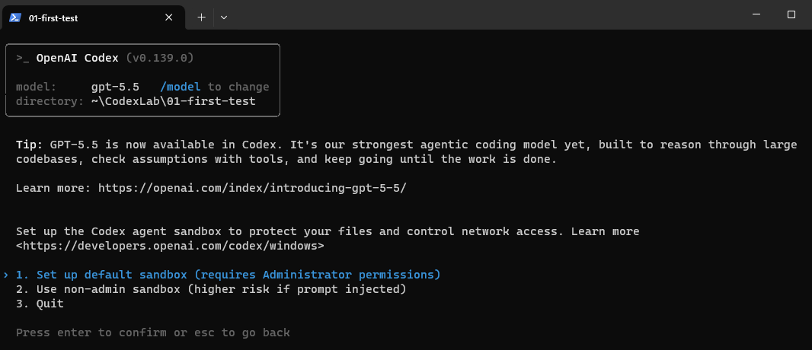

A Windows az alábbi segédprogramot nem találta:

```text
codex-windows-sandbox-setup.exe
```

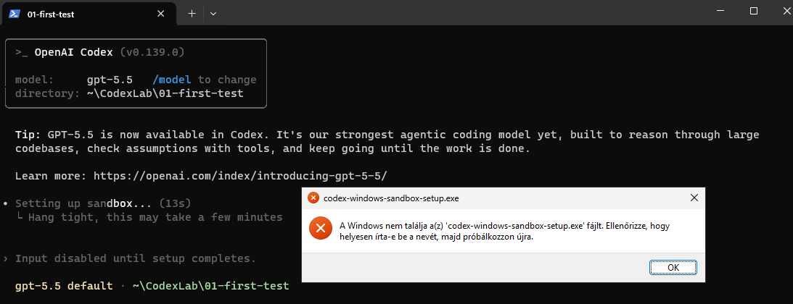

A kezdeti teszteléshez ezért a nem rendszergazdai Windows-sandbox került kiválasztásra.

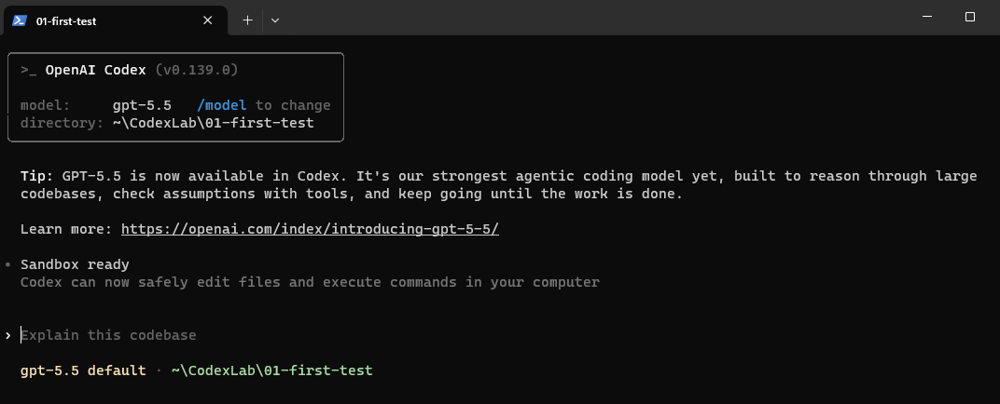

A munkamenet aktuális konfigurációja a `/status` slash paranccsal lett ellenőrizve.

A nyilvános képernyőképen a személyes adatok és a munkamenet-azonosító kitakarásra kerültek.

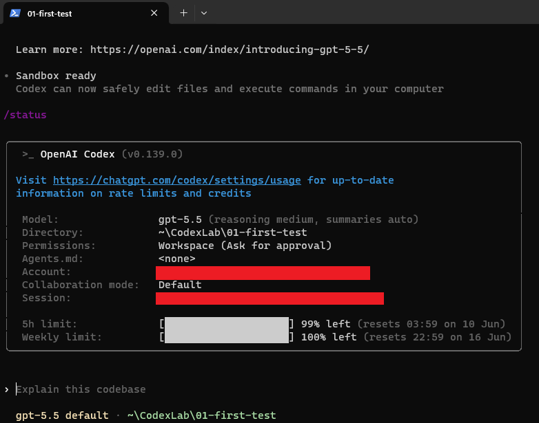

## Jelenlegi állapot

```text
Elkészült:
- Windows 11 telepítése és frissítése
- internetelérés az OPNsense EDGE NAT-rétegen keresztül
- biztonságos rendszerindítás engedélyezése
- virtuális TPM engedélyezése
- Hyper-V vendéggép-szolgáltatás kikapcsolása
- tiszta Windows-alapállapot mentése
- külön standard felhasználó létrehozása
- bővített munkamenet engedélyezése a standard felhasználónak
- a standard felhasználói identitás ellenőrzése
- standard felhasználói alapállapot mentése
- Codex CLI telepítése kizárólag a standard felhasználói profilba
- Codex CLI verzióellenőrzése
- Codex CLI telepítése utáni alapállapot mentése
- első elkülönített munkamappa létrehozása
- ChatGPT-fiókos hitelesítés
- az első interaktív indítás
- munkakönyvtár megbízhatósági megerősítése
- nem rendszergazdai Windows-sandbox aktiválása
- az első Codex-munkamenet állapotának ellenőrzése
```
